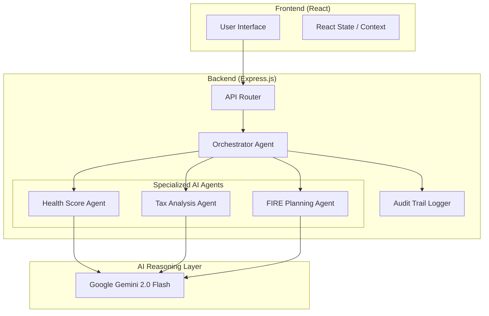

# AI Money Mentor — Architecture Document

## System Overview
MoneyMentor is built on a **Multi-Agent Orchestration Architecture**. Instead of a single monolithic AI, the system delegates specific financial domains to specialized agents, ensuring higher accuracy and auditable reasoning.

## Architecture Diagram

## Agent Roles & Responsibilities

1.  **Orchestrator Agent**: 
    - Coordinates between the API and specialized agents.
    - Manages the **Audit Trail**, logging every input, reasoning step, and output for transparency.
2.  **Health Score Agent**:
    - Analyzes 6 dimensions of financial wellness.
    - Evaluates data against Indian personal finance benchmarks (e.g., 6 months' expense for emergency funds).
3.  **Tax Analysis Agent**:
    - Specializes in the Indian Income Tax Act.
    - Compares tax liability under different regimes and suggests optimization strategies.
4.  **FIRE Planning Agent**:
    - Mathematical specialist for compounding and corpus calculations.
    - Generates long-term roadmaps based on inflation and return rate assumptions.

## Tool Integrations
- **Chart.js**: Used for rendering complex financial data (Radar charts for health, Line charts for FIRE projections).
- **Audit Logging**: Every decision the AI makes is stored in a structured log for debugging and user trust.

## Error Handling
- The system includes graceful fallbacks. If the Gemini API is unreachable or rate-limited, the agents use built-in heuristic logic to provide "Smart Fallback" insights so the user still receives value.
